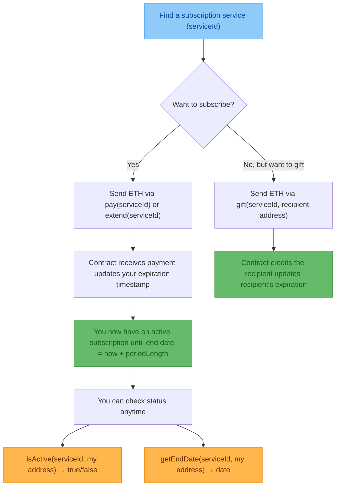
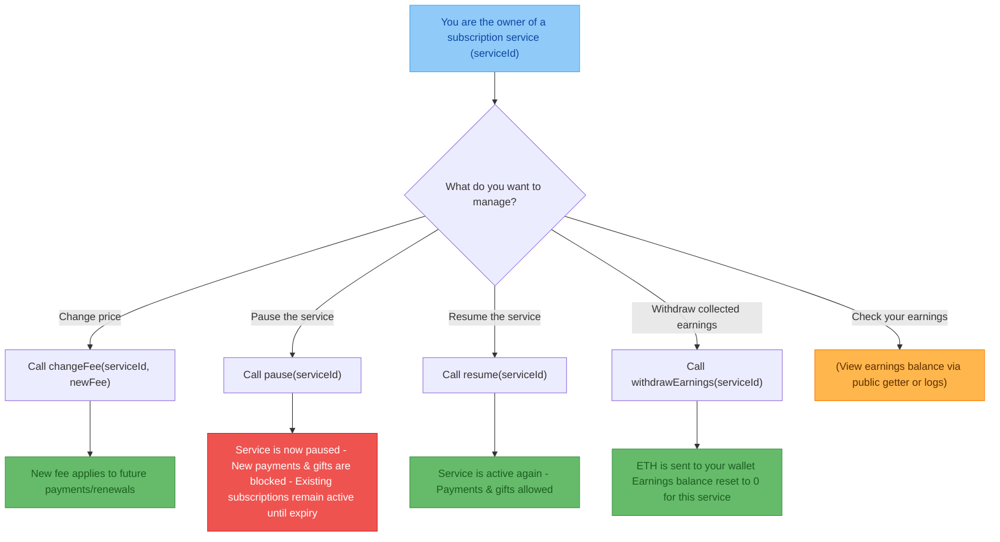
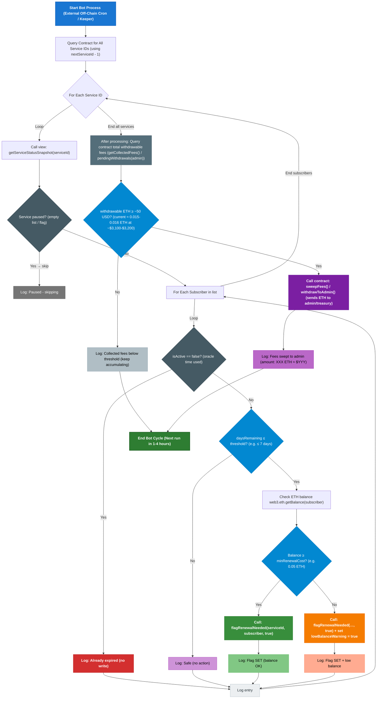

# evm-subscription-project

## High-Level User Flow

### Subscriber Flow

### Admin Flow

### Bot/Keeper Flow

## Gas Optimizations

**1. Custom Errors**

Replaced string require messages with custom errors (ServiceDoesNotExist(), ServicePaused(), etc.).
Helps for keeper function sweepFees() called frequently.

**2. Bulk Payment Support (Gas + UX Optimization)**

Modified `_subscribe()` to accept multiples of base fee (_value % service.fee == 0).
Users pay for 10 periods in 1 tx instead of 10 separate txs
Saves gas for each avoided transaction.

**3. Single FeesSwept Event (Gas Optimization)**

`sweepFees()` emits 1 `FeesSwept(totalSwept)` instead of N `EarningsWithdrawn()` events as it was first
Saves gas per N services
Less logging
Still the important part that gets emitted.

