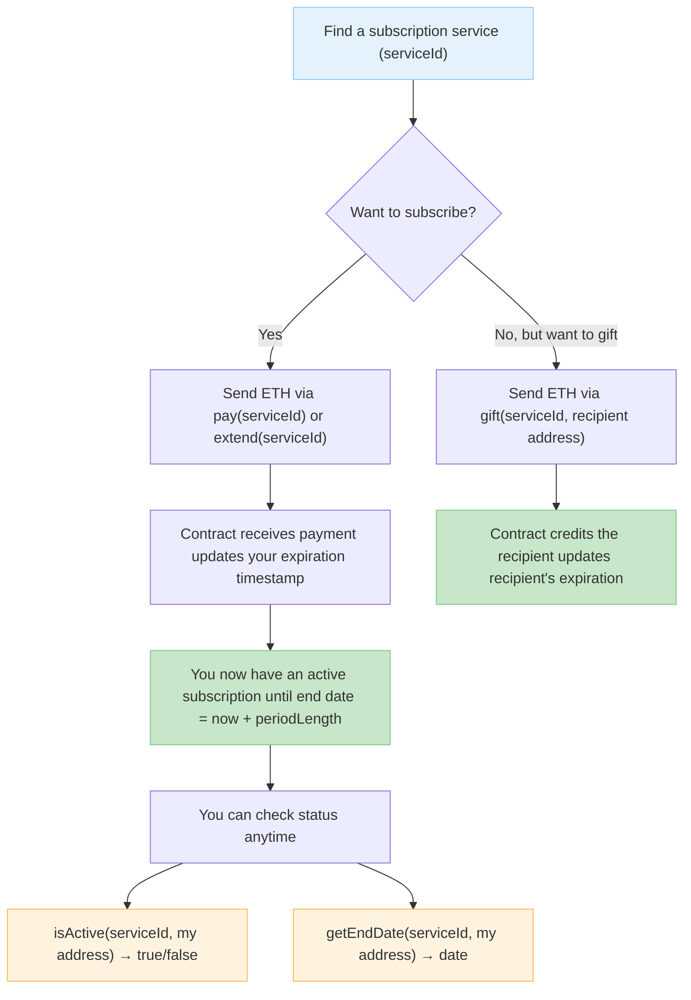

# evm-subscription-project

## High-Level User Flow

### Subscriber Flow

```mermaid
flowchart TD
    A["Find a subscription service (serviceId)"] --> B{"Want to subscribe?"}

    B -->|Yes| C["Send ETH via pay(serviceId) or extend(serviceId)"]
    C --> D["Contract receives payment updates your expiration timestamp"]

    D --> E["You now have an active subscription until end date = now + periodLength"]

    B -->|No, but want to gift| F["Send ETH via gift(serviceId, recipient address)"]
    F --> G["Contract credits the recipient updates recipient's expiration"]

    E --> H["You can check status anytime"]
    H --> I["isActive(serviceId, my address) → true/false"]
    H --> J["getEndDate(serviceId, my address) → date"]

    style A fill:#e3f2fd,stroke:#90caf9
    style E fill:#c8e6c9,stroke:#81c784
    style G fill:#c8e6c9,stroke:#81c784
    style I fill:#fff3e0,stroke:#ffb74d
    style J fill:#fff3e0,stroke:#ffb74d
```

